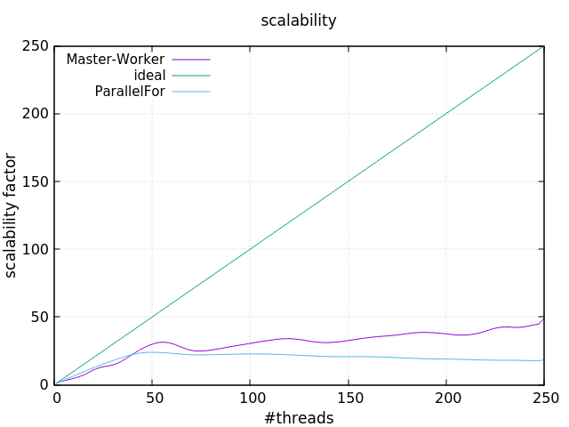

# Finding primes

This is the second assignment for the class of [Parallel and Distributed Systems](http://didawiki.di.unipi.it/doku.php/magistraleinformaticanetworking/spm/sdpm09support) @Unipi. I developed two implementations for the problem of finding prime numbers among a given range, using different patterns provided by the [FastFlow library](http://calvados.di.unipi.it/).  

The two patterns are:
* **Master Worker** farm (see file [MasterWorker.h](https://github.com/FraCorti/PSD-Assignments/blob/master/SecondAssignmentParallel/MasterWorker.h)) and
* **Parallel For** (see file [FastflowParallelFor.h](https://github.com/FraCorti/PSD-Assignments/blob/master/SecondAssignmentParallel/FastflowParallelFor.h))
  

## Getting Started

To build the project simply clone the repo and build it using the cmake file provided.


### Building
To generate the build system do:  
```
mkdir -p build
cd build
cmake ..
```
in the root of the cloned project.  

Now build the project:
```
cmake --build .
```


### Running
The executable can be found in the ```build/``` directory. Just run it with:

```./build/SecondAssignmentParallel``` 


## Results
The experience results are summarized in some plots that express the scalability and the speedup obtained running the code on the Xeon-phi machine (see [benchmark folder](https://github.com/FraCorti/PSD-Assignments/tree/master/SecondAssignmentParallel/benchmark) for more images and data obtained).  
The benchmark depicts one situation:
* finding primes in the range 0~50mln

For the scenario I computed the execution time considering 1 up to 250 threads. Following are illustrated the plots with the metrics described. 





## Plotting

To obtain the data used in the results shown you have to build the project in two different ways: the first by leaving in ```main.cpp```  just the execution of the MasterWorker farm and the second by executing only the ParallelFor. Refer to [main.cpp](https://github.com/FraCorti/PSD-Assignments/blob/master/SecondAssignmentParallel/main.cpp) to understand what this means in practice.  
The two executables obtained must be put in a folder called ```builds/``` in order for the ```benchmark.sh``` script to work properly. These two executable should be called respectively ```finding_primes_MW``` and ```finding_primes_PF```.  

*To change the namings just edit the variables in *```benchmark.sh```.

Running the script with ```./benchmark.sh``` will generate the data for plotting in the folder ```plotting-and-data/data/```. To obtain the plots just open [Gnuplot](http://www.gnuplot.info/) in the folder ```plotting-and-data/``` and load the scripts with

```load "<script-name.gp>"```
 

## Authors

**Francesco Corti** in collaboration with my roommates and colleagues [Davide](https://github.com/dbarasti) and [Giovanni](https://github.com/GiovanniSorice)  

## Acknowledgments
This project was developed for an assignment of the course [Parallel and Distributed Systems](http://didawiki.di.unipi.it/doku.php/magistraleinformaticanetworking/spm/sdpm09support) at University of Pisa under the guide of [Prof. Marco Danelutto](http://calvados.di.unipi.it/paragroup/danelutto/) and [Prof. Massimo Torquati](http://calvados.di.unipi.it/paragroup/torquati/).


